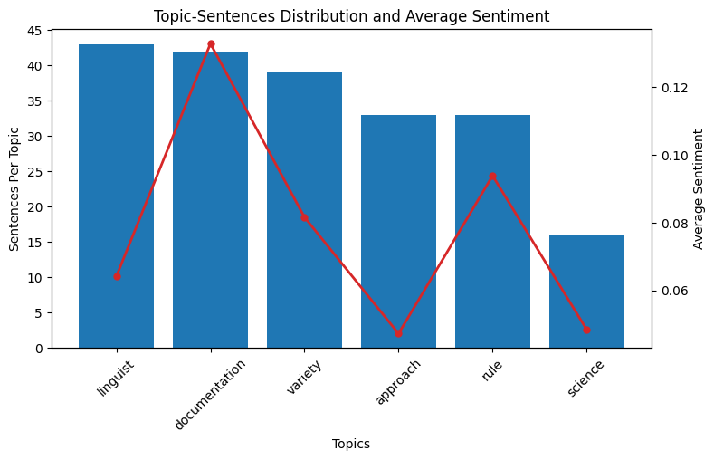

# AllMeans

Automatic Topic Modelling (TM) using minimal user input and computational resources. I made this because my biggest issue with most TM modules is simple. If I knew how many topics I wanted, I would already have enough information about the text, such that performing TM would be redundant. AllMeans does not aim to replace existing TM frameworks, but instead aims to tackle the aspect of required user input to derive meaningful insights. With AllMeans, the user is simply required to pass a text, and run one method, with optionally ZERO decisions.

See `Basic Modelling` example, below. AllMeans is designed to be simple, user-friendly, and practical. It doesn't invent anything that doesn't already exist in the passed text (it doesn't require loading enormous Word Embeddings models like GloVe). All that is needed is a text (string), in one string (no pre-processing needed), to create an AllMeans object, and to run the .model_topics() method.

Though AllMeans is not itself a single unsupervised algorithm, it relies on unsupervised algorithms to perform topic modelling, which inherently works better with more data. AllMeans was developed with tests on texts from 1,000 to 100,000 characters in length, as it is intended to be flexible, but quality of results will likely typically correlate positively with the size of the passed text.

## Usage

Install using: `$ pip install AllMeans`.

### Modelling Topics with AllMeans.model_topics()

There are only two arguments to the .model_topics(), `early_stop` and `verbose`. Verbosity is a boolean, offering to print progress and a glimpse of the results as the method runs, and `early_stop` strongly positively correlates with the number of resulting topics found, though it is not a 1:1 relationship (i.e., passing early_stop = 3 will not necessarily result in 3 topics). As the method largely relies on iteratively comparing various Kmeans clustering results (through an averaged silhouette_score and davies_bouldin_score - both of which, sklearn's implementations), the early_stop value (default = 2) determines after how many consecutively negatively trending iterations the method stops. The motivation for this being that there is typically a certain Kmeans value that scores best, after which point scores trend downwards, making these iterations often redundant. Thus, a lower early_stop value (\~2) will significantly decrease computational expense and time, but may also change performance. As each early_stop value does not necessarily build on lower values (for example, early_stop = 3 is not necessarily the same topics as early_stop = 2, plus *x* more topics), I suggest trying 2 or 3 values (I like to test a range of values for early_stop such as \[2, 3, 4, 5\]) to see how the passed text can be represented.

### Version 1.0.4 - 'exclusions' and 'excl_sim'

In this update, the `exclusions` and `excl_sim` arguments were introduced to the .model_topics() method, allowing the user to pass a list of strings, which excludes any potential cluster labels with a Jaro Winkler Similarity > `excl_sim` value (float between 0 and 1) (using Jellyfish: https://pypi.org/project/jellyfish/) to be excluded from consideration. Suggested usage of the `exclusions` arg is to first pass nothing to it (the arg default is an empty list), and to iteratively and incrementally add more words to the passed list until chosen cluster labels are satisfactory. Suggested value for `excl_sim` is 0.9, but testing different values may prove more beneficial depending on the vocabulary.

## Examples

### Basic Modelling

```         
# !pip install AllMeans
from AllMeans import AllMeans

# assuming you have a text in the string variable `text`
allmeans = AllMeans(text = text)
clusters = allmeans.model_topics(
    early_stop = 2, # default value
    verbose = False # default value
)
>>> returns a dict of {str : list[str]} pairs of topics and lists of all sentences relevant to each topic
```

Note:

- As a reminder, try different values for `early_stop`. I like to try \[2, 3, 4, 5\], but keep in mind that higher values will result in exponentially larger runtime, and more topics found

### Plotting AllMeans.model_topics() Results

This example gets the text from the "Linguistics" Wikipedia, models its topics and plots the distribution of sentences relating to each topic and the mean sentiment (using NLTK's VADER module) of the context relating to each topic.

```         
# !pip3 install wikipedia-api
import wikipediaapi
wiki_wiki = wikipediaapi.Wikipedia('USER_AGENT_HERE', 'en') # check https://pypi.org/project/Wikipedia-API/ "user_agent" to understand this
page_py = wiki_wiki.page("Linguistics") # gets the text of entire Wikipedia "Linguistics" page
text = page_py.text # returns str of entire page text -> check package docs for more useful methods

import nltk
from nltk.sentiment import SentimentIntensityAnalyzer
import matplotlib.pyplot as plt
from matplotlib.ticker import MaxNLocator

def average_compound_sentiment(texts):
    sia = SentimentIntensityAnalyzer()
    compound_scores = [sia.polarity_scores(text)['compound'] for text in texts]
    avg_score = sum(compound_scores) / len(compound_scores) if compound_scores else 0
    return avg_score

# !pip install AllMeans
from AllMeans import AllMeans
# Use AllMeans to model topics from page
allmeans = AllMeans(text = text)
clusters = allmeans.model_topics(early_stop = 5, verbose = True)
# >>> Note: there will be many printouts here due to verbose = True

# Prepare the topics-sentences distribution data and mean sentiment per topic
dist = {lab: len(sents) for lab, sents in clusters.items()}
sorted_dist = dict(sorted(dist.items(), key = lambda item: item[1], reverse = True))
avg_sentiments = {key: average_compound_sentiment(value) for key, value in clusters.items()}

# Prepare data for plotting
labels = list(sorted_dist.keys())
counts = [dist[label] for label in labels]
avg_sa = [avg_sentiments[label] for label in labels if label in avg_sentiments]

# Create figure and primary axis
fig, ax1 = plt.subplots(figsize = (8, 5))

# Plot the topics-sentences distribution
color = 'tab:blue'
ax1.set_xlabel('Topics')
ax1.set_ylabel('Sentences Per Topic')
ax1.bar(labels, counts, color = color)
ax1.tick_params(axis = 'y')
ax1.tick_params(axis = 'x', rotation = 45)

# Create a secondary axis for the average sentiment
ax2 = ax1.twinx()
color = 'tab:red'
ax2.set_ylabel('Average Sentiment')
ax2.plot(labels, avg_sa, color = color, marker = 'o', linestyle = '-', linewidth = 2, markersize = 5)
ax2.tick_params(axis = 'y')

# Use integer locator for sentences count axis
ax1.yaxis.set_major_locator(MaxNLocator(integer = True))

fig.tight_layout()  # Adjust layout to make room for the rotated x-axis labels
plt.title('Topic-Sentences Distribution and Average Sentiment')
plt.show()
```

{width="637"}